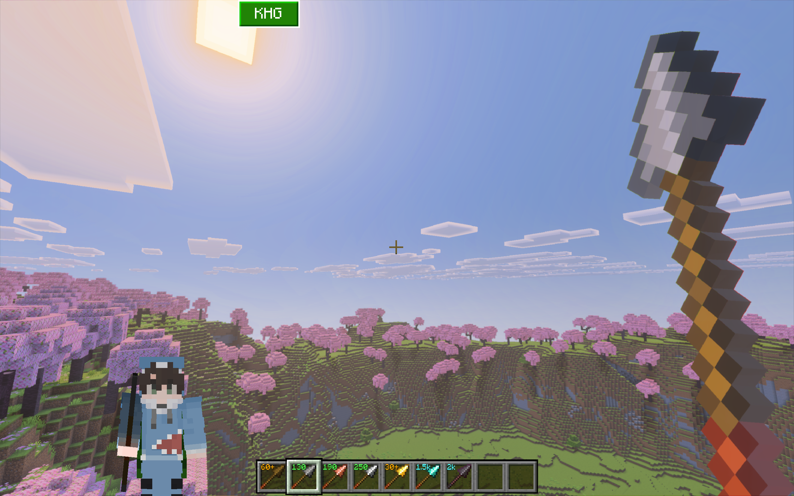
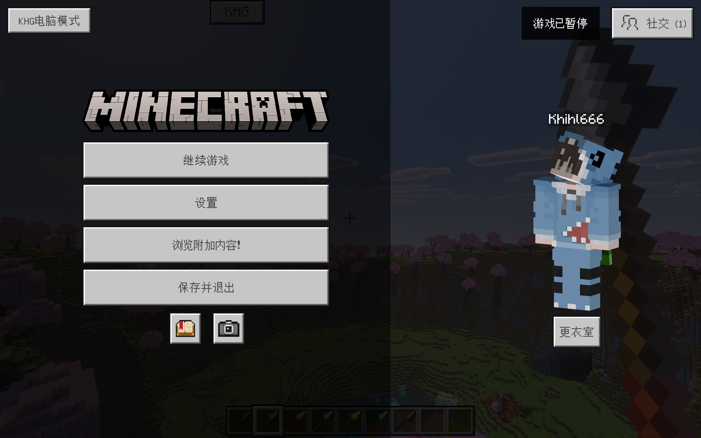
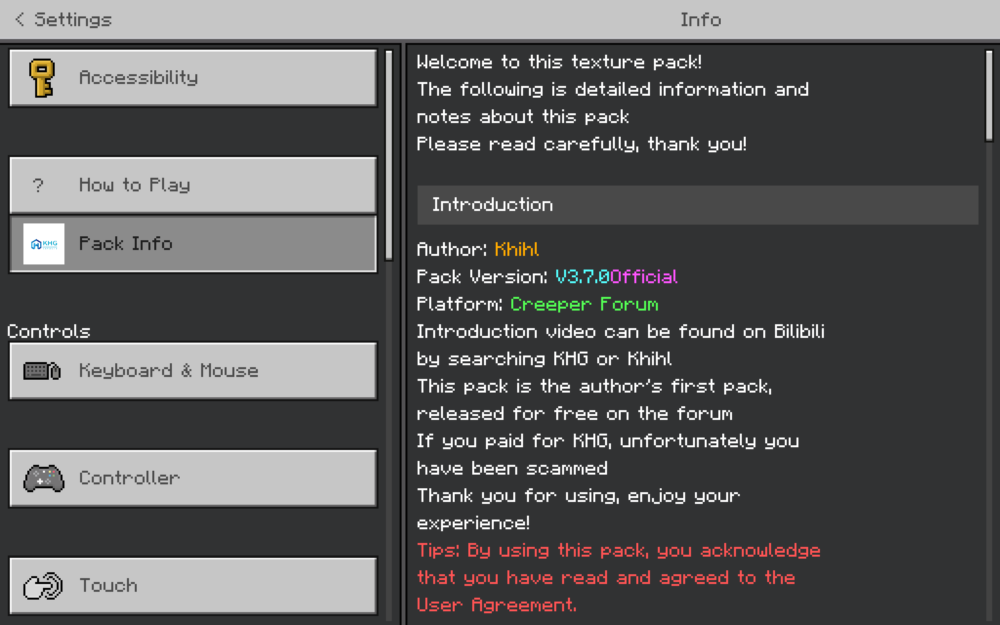
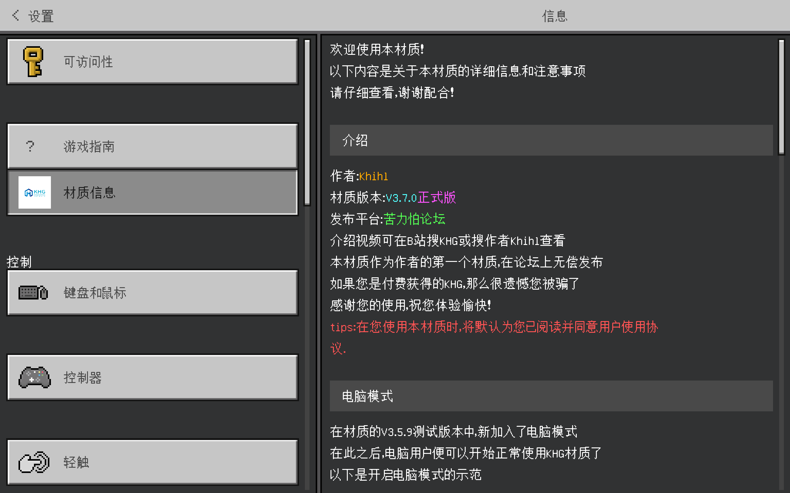

[English Version](#english) · [中文版](#chinese)

---

# ❄️ KHG Functional Resource Pack · V3.7 Official Release  
### Original | Reborn | Supports 1.13.x – 26.1 | 10+ Powerful Features | Compatible with Other UIs

  

  ❄️ <b>KHG Functional Resource Pack</b> — Open Source · Lightweight · More Stable ❄️

---

## ⚠️ Bug Report & 💡 Troubleshooting

- **Found a bug?** Join the group and report directly to the developer:  
  

- **Troubleshooting** — If you encounter any issues, feel free to join the official group above. The developer and enthusiastic players will be happy to help you promptly!

---

## 📖 Introduction

**KHG Functional Resource Pack** is a powerful auxiliary tool that gives you features in normal gameplay that were previously impossible or required cheats. It is compatible with most UI beautification packs, and button appearances automatically adapt to the UI style. **Supports both mobile and PC!**

### 🎯 Feature Details

#### 🔘 Buttons

- 📸 **GUI Quick Button**: One-tap to clear all HUD elements — perfect for clean screenshots and sharing your best moments.
- 🧑‍🤝‍🧑 **Paper Doll Button**: Quickly toggle the paper doll to check your character's look, no need to dive into settings menus.
- 🔄 **Toggle Button**: Placed on both sides of the hotbar for lightning-fast slot switching — a perfect edge for stylish PvP combat.

#### 🖥️ Display

- 🎯 **Crosshair**: Brings a PC-style crosshair to mobile, with classic cross, dynamic rainbow, and many other styles to choose from — making mobile controls more precise.
- 🖱️ **Cursor**: A fun PC-like mouse pointer for mobile, eight styles available — purely for entertainment, adds a desktop flavor to your mobile experience.
- 🎨 **Screen Rendering**: Freely choose your favorite visual style, including brightness adjustment and more rendering effects — one tap to switch, instant results.
- 🏷️ **Handheld Display**: Clearly shows the name and icon of the item in your hand — the name never fades, more persistent and visible than vanilla.
- 🛡️ **Durability Display**: An enhanced durability system — supports 1~10,000 durability range with color-coded stages: red warning for low, green for high. Works in single-player, multiplayer, and servers alike.
- 👤 **Better Paper Doll**: Want to see a bigger portrait of your character? This is it! Freely adjustable position, larger and clearer than the vanilla paper doll.
- 🌐 **Game Language**: See your current game language at a glance — no more digging through settings to check.
- ⚡ **Experience Display**: Shows your XP count even in Creative mode, breaking vanilla's limitation of hiding XP in Creative.
- 🕐 **Game Items**: Pins the clock and compass directly on your screen — no crafting required, no hotbar slots taken, one-tap toggle, as powerful as a cheat!

| Item | Details |
|------|------|
| 🧑‍🎨 **Developer** | Khihl |
| 🌟 **Current Version** | **V3.7.0 Official** |
| 🎮 **Supported Versions** | **1.13.x – 26.1** (Recommended 1.16~26.1) |

> ⭐ **If you like this project, please give it a Star to support the developer!**

---

## 🖼️ Screenshots & Overview

### 🏠 Main Panel

The main operating interface, clearly divided into **Button** and **Display** functional areas. All buttons are freely draggable, and their appearance adapts to the UI style, providing a consistent experience on mobile and PC.

  

> 📌 The image above shows the full main panel, covering the complete layout of button controls and display features.

---

### 🔧 Durability Display

Displays the current durability value of equipment and tools in real time, supporting durability ranges from 1 to 10000. V3.7 introduces **color coding**, visually distinguishing durability levels with different colors for a more refined look.

  

> 🎨 Durability colors dynamically change based on the remaining percentage, making equipment status clear at a glance.

---

### 📋 Feature Overview

A glance at all KHG features. From HUD buttons, Paper Doll buttons, to crosshair, cursor, screen rendering, handheld display, durability display, better Paper Doll, game language, experience display, compass & clock display — over 20 features all shown.

  

> ⚡ All features can be individually toggled, combined as needed — no bloat, no conflicts.

---

### 💻 PC Mode

An optimized layout for desktop. Button positions and panel arrangements are adjusted for keyboard and mouse operation, delivering the same smooth functional experience as on mobile.

  

> 🖥️ In PC Mode, button hitboxes and layout automatically adapt, providing a seamless transition between mobile and desktop.

---

### 🌐 English Interface

V3.7 officially supports English translation. Below is a look at the English UI, meeting the needs of international players.

  

  <em>▲ English UI</em>

> 🌍 The language switches automatically based on game settings. Use English / Chinese as you like.

---

## 📋 Changelog

Click to expand update details

**KHG V3.7.0 Official Release**  
1. Optimized code with AI assistance, improving performance.  
2. Adapted for latest Minecraft versions to ensure normal usage.  
3. Removed the auxiliary panel (frequent bugs, prone to cause player model issues, poor compatibility).  
4. Added color coding to durability display for a more refined style.  
5. Officially removed encryption to reduce pack size and become open source.  
6. Added English translation, officially supporting English.

**KHG V3.7.0 Beta**  
1. Fixed unresponsive KHG buttons in newer versions.  
2. Modified KHG button hiding logic; now hides based on device type.  
3. Revised the user agreement.

**KHG V3.6.0 Chinese New Year Special Edition**  
1. Integrated the updates from V3.6.0 Beta.  
2. Added a mysterious feature (???).  
3. Adapted for desktop mode.

**KHG V3.6.0 Beta**  
1. Reorganized the layout of display features.  
2. Removed the "Retrospective Compass" feature (extremely unstable display).  
3. Adjusted toggle button positions; now placed on both sides of the hotbar.  
4. Added custom drag function for GUI buttons and Paper Doll buttons, and removed the white background from both buttons.  
5. Changed brightness rendering method to screen rendering and added more rendering features.  
6. Improved the content of pack information.

**KHG V3.5.9 Beta – Bug Fix**  
1. Simplified crosshair-related code.  
2. Fixed the issue where "Better Paper Doll", crosshair, and cursor could not be displayed simultaneously.

**KHG V3.5.9 Beta**  
1. Fixed GUI button disappearing after being pressed, and added drag functionality.  
2. Fixed the "Retrospective Compass" incorrectly turning into a boat.  
3. Adjusted button position offsets.  
4. Initial adaptation for PC (some minor flaws remain).  
5. Added movement status display.  
6. Added cursor feature (eight styles available).  
7. Updated pack info section and added PC mode usage instructions.  
*Note: This is the last beta test version for the 3.5 Beta series.*

**KHG V3.5.8 Beta**  
Emergency fix for an error in the information panel.

**KHG V3.5.7 Beta**  
1. Added position options for "Better Paper Doll", allowing free adjustment of the paper doll's display position.  
2. Lowered the positions of force coordinates, clock, compass, and retrospective compass so they no longer overlap the hunger bar; language and experience displays also lowered to prevent KHG buttons from overlapping them.  
3. Moved pack info section to settings screen and added troubleshooting & user agreement.  
4. Added an obvious easter egg.

**KHG V3.5 Official Release**  
1. Integrated all content from the Beta versions.  
2. Strengthened anti-piracy measures.  
3. Optimized various details to improve user experience.

**KHG V3.5.6 Beta**  
1. Adjusted positions of "Better Paper Doll" and FPS display.  
2. Fixed the issue of incorrect shield texture display in the offhand.  
3. Added item durability display (supports durability values from 1 to 10000; abbreviated to tens when >100, hundreds when >500, thousands when >1000).  
4. Improved the Paper Doll button texture.  
5. Enhanced anti-resale measures (added encryption protection against potential violations).

**KHG V3.5.5 Beta**  
1. Added rainbow dynamic crosshair.  
2. Added sliding panel.  
3. Crosshair now uses an overlay replacement mechanism; only one crosshair style can be displayed at a time, default is no crosshair.

**KHG V3.5.4 Beta**  
1. Re-adjusted the classification order of certain features. Display features work normally in most mod environments, but occasional texture glitches may occur due to the game itself; auxiliary features have limited stability due to Bedrock Edition API restrictions and may have errors in specific environments. Please understand.  
2. Adjusted positions of some controls.

**KHG V3.5.3 Beta**  
1. Important fix: pressing buttons no longer interferes with in-game swipe actions.  
2. Some control offsets now use percentage units for better adaptation to mobile devices with different resolutions.  
3. Added "Better Paper Doll" feature.  
4. Renamed "Handheld Item Name" feature to "Handheld Item Display" (integrating item name and icon display).  
5. Added retrospective compass display.

**KHG V3.5.2 Beta**  
1. Fixed several issues and optimized user experience.  
2. Added brightness rendering feature.  
3. Completed layout for the third-level sub-panel.

**KHG V3.5.1 Beta**  
Note: Added user agreement and introduced GPL 3.0 license.  
1. Completely refactored panel code, re-adjusted layout, and enhanced compatibility.  
2. Added handheld item name display.  
3. Added chunk map display.  
4. Added five crosshair styles, freely selectable (displayed side by side in this version).  
5. Moved pack info position to the bottom-left corner to match panel layout.

**KHG V3.5.0 Beta**  
1. Added FPS display.  
2. Added armor display.  
3. Added offhand display.  
4. Added progress display feature (including speed display and eating progress).  
5. Added experience display.

---

## 📥 Download

Simply package and download the source files.

---

  ❄️ Open Source · Lightweight · More Stable — If you like this project, please light up a ⭐Star to support! ❄️

---

# ❄️ KHG 功能材质 · V3.7 正式版  
### 原创 | 秽土转生 | 支持 1.13.x - 26.1 | 10+ 强大功能 | 兼容其它 UI

  

  ❄️ <b>KHG 功能材质</b> — 开源 · 轻量 · 更稳定 ❄️

---

## ⚠️ 问题反馈 & 💡 疑难解答

- **遇到 Bug？** 请加群直接反馈作者：  
  

- **疑难解答** —— 使用中遇到任何问题，欢迎加入上方官方群，作者与热心玩家将及时为你提供帮助！

---

## 📖 材质介绍

**KHG 功能材质**是一款强大的功能性辅助工具，让您在正常游戏中获得以往无法实现或需作弊才能使用的功能。材质兼容绝大多数 UI 美化，按钮外观可随 UI 风格自动变化，**同时支持手机与电脑端使用！**

### 🎯 功能介绍

#### 🔘 按钮类

- 📸 **GUI 快捷按钮**：一键清屏，隐藏所有 HUD 元素，方便截图分享，记录你的精彩瞬间。
- 🧑‍🤝‍🧑 **纸娃娃按钮**：快速开关纸娃娃，随时看清自己的模样，操作便捷，无需进入设置菜单。
- 🔄 **切换按钮**：置于物品栏两侧，实现物品栏极速切换，助力 PvP 花式战斗操作。

#### 🖥️ 显示类

- 🎯 **准星**：为手机版提供模拟电脑端的准星，提供经典十字、动态七彩等多种样式可供选择，让移动端操作更加精准。
- 🖱️ **光标**：尝试提供像电脑一样的鼠标指针，共八种样式可选，仅供娱乐，为手机版增添桌面端的趣味体验。
- 🎨 **屏幕渲染**：自由选择你喜爱的游戏风格，包含亮度调节等多种渲染效果，一键切换，即刻生效。
- 🏷️ **手持显示**：轻松显示你手上的物品名称与图标，名称不会随时间消失，比原版更持久醒目。
- 🛡️ **耐久显示**：更强大的耐久显示系统——支持 1~10000 耐久范围，不同耐久阶段以不同颜色直观标注，低耐久红色警示、高耐久绿色安心。且不止局限于单人游戏，多人联机与服务器均可正常使用。
- 👤 **更好的纸娃娃**：想看你的角色大头照吗？就选它！支持自由调整显示位置，比原版纸娃娃更大更清晰。
- 🌐 **游戏语言**：一目了然显示当前使用的游戏语言，再也不用翻设置确认了。
- ⚡ **经验显示**：在创造模式下也能显示你的经验持有数，打破原版创造模式不显示经验的限制。
- 🕐 **游戏物品**：直接将时钟与指南针固定在屏幕上，无需制作、无需占用物品栏，一键开关，堪比作弊！

| 项目 | 详情 |
|------|------|
| 🧑‍🎨 **作者** | Khihl |
| 🌟 **当前版本** | **V3.7.0 正式版** |
| 🎮 **支持版本** | **1.13.x – 26.1**（推荐 1.16~26.1） |

> ⭐ **如果喜欢这个项目，请给个 Star 支持作者！**

---

## 🖼️ 内容展示

### 🏠 材质面板

材质的主操作界面，清晰划分为**按钮类**与**显示类**两大功能区。所有按钮可自由拖动，外观随 UI 风格自适应，兼顾手机与电脑端体验。

  

> 📌 上图为主面板全貌，涵盖按钮控制区与显示功能区的完整布局。

---

### 🔧 耐久显示

实时展示装备与工具的当前耐久数值，支持 1 至 10000 的耐久范围。V3.7 新增**颜色标注**，根据耐久高低以不同颜色直观区分，样式更精美。

  

> 🎨 耐久数值颜色随剩余百分比动态变化，装备状态一目了然。

---

### 📋 功能总览

一图纵览 KHG 的全部功能。从 HUD 按钮、纸娃娃按钮，到准星、光标、屏幕渲染、手持显示、耐久显示、更好的纸娃娃、游戏语言、经验显示、指南针与时钟显示——20+ 功能悉数呈现。

  

> ⚡ 所有功能均可独立开关，按需组合，不臃肿、不冲突。

---

### 💻 电脑模式

专为桌面端优化的操作布局。按钮位置、面板排列均针对键盘鼠标操作调整，在电脑上享受与手机端同样流畅的功能体验。

  

> 🖥️ 电脑模式下按钮判定与布局自动适配，手机与电脑切换无缝衔接。

---

### 🌐 中文界面

V3.7 正式支持中文翻译。以下为中文界面的展示，满足国内玩家需求。

  

  <em>▲ 中文界面</em>

> 🌍 语言根据游戏设置自动切换，中文 / English 随心使用。

---

## 📋 更新日志

点击展开更新详情

**KHG V3.7.0 正式版**  
1. 借助 AI 辅助优化了代码，提升了材质性能。  
2. 已完成对新版本的适配，确保材质在新版本中可正常使用。  
3. 移除了辅助类面板（bug 频出，且容易导致玩家模型异常，兼容性差）。  
4. 为耐久显示添加了颜色标注，样式更精美。  
5. 正式移除加密措施，减轻材质包大小，并实现开源。  
6. 添加英文翻译，正式支持英文。

**KHG V3.7.0 Beta 版**  
1. 修复了在高版本中 KHG 按钮无响应的问题。  
2. 修改了 KHG 按钮的隐藏判定条件，现根据使用设备类型决定按钮是否隐藏。  
3. 修订了用户使用协议。

**KHG V3.6.0 春节特别版**  
1. 整合了 V3.6.0 Beta 版的更新内容。  
2. 新增神秘特性（???）。  
3. 适配桌面模式。

**KHG V3.6.0 Beta 版**  
1. 重新整理了显示类功能的界面排版。  
2. 移除了"追溯指南针"功能（因其显示极不稳定）。  
3. 调整了切换按钮的位置，现移至物品栏两侧。  
4. 为 GUI 按钮与纸娃娃按钮增加了自定义拖动功能，并移除了两个按钮的白色背景。  
5. 将亮度渲染方式修改为屏幕渲染，并增添了更多渲染功能。  
6. 改善了材质信息的内容。

**KHG V3.5.9 Beta 版 Bug 修复**  
1. 精简了准星的相关代码。  
2. 修复了"更好的纸娃娃"、准星与光标无法同时显示的问题。

**KHG V3.5.9 Beta 版**  
1. 修复了 GUI 按钮按下后消失的问题，并为其添加了拖动功能。  
2. 修复了"追溯指南针"错误变为船的问题。  
3. 对按钮位置偏移进行了调整。  
4. 初步适配电脑端（当前仍存在少量瑕疵）。  
5. 新增运动状态显示功能。  
6. 新增光标功能（共提供八种样式）。  
7. 更新了材质信息板块，并新增电脑模式使用说明。  
*注：此为 3.5 Beta 版本的最后一个测试版本。*

**KHG V3.5.8 Beta 版**  
紧急修复了信息面板的错误。

**KHG V3.5.7 Beta 版**  
1. 为"更好的纸娃娃"添加了位置选项，允许自由调整纸娃娃的显示位置。  
2. 将强制坐标显示、时钟、指南针及追溯指南针的显示位置统一下调，使其不再遮挡饥饿条；语言显示与经验显示也相应下调，确保 KHG 按钮不会对其造成遮挡。  
3. 材质信息板块移至设置界面，并新增疑难解答与用户使用协议。  
4. 添加了一个明显的彩蛋。

**KHG V3.5 正式版**  
1. 整合了 Beta 版中的所有内容。  
2. 强化了反盗版措施。  
3. 优化了若干细节，提升了用户体验。

**KHG V3.5.6 Beta 版**  
1. 调整了"更好的纸娃娃"与 FPS 显示的位置。  
2. 修复了副手盾牌贴图显示错误的问题。  
3. 新增物品耐久显示功能（支持显示 1 至 10000 的耐久数值；耐久超过 100 时以整十为单位简写，超过 500 时以整百为单位简写，超过 1000 时以整千为单位简写）。  
4. 改善了纸娃娃按钮的贴图。  
5. 强化了反盗卖措施（针对可能违反协议的行为，增设了加密保护）。

**KHG V3.5.5 Beta 版**  
1. 新增七彩动态准星。  
2. 加入了滑动面板。  
3. 现在准星采用覆盖替换机制，同一时间仅能显示一种准星样式，默认设置为无准星。

**KHG V3.5.4 Beta 版**  
1. 重新调整了部分功能的分类顺序。显示类功能在多数模组环境下均可正常使用，但偶尔可能出现贴图错乱，这属于游戏本身的特性；辅助类功能因受基岩版 API 的限制，稳定性欠佳，在特定环境下可能出现错误，敬请谅解。  
2. 对部分控件的位置进行了调整。

**KHG V3.5.3 Beta 版**  
1. 重要修复：现在按下按钮时，不会再干扰游戏的滑动操作。  
2. 部分控件的位移方式改用百分比单位，以更好地适配不同分辨率的移动设备。  
3. 新增"更好的纸娃娃"功能。  
4. "手持物品名称"功能更名为"手持物品显示"（整合了手持物品名称与图标显示）。  
5. 新增追溯指南针显示功能。

**KHG V3.5.2 Beta 版**  
1. 修复了若干问题，优化了使用体验。  
2. 新增亮度渲染功能。  
3. 完成了第三级子面板的布局构建。

**KHG V3.5.1 Beta 版**  
注：新增用户使用协议，并引入 GPL 3.0 许可证。  
1. 对面板代码进行了全面重构，重新调整了布局，增强了兼容性。  
2. 新增手持物品名称显示功能。  
3. 新增区块地图显示功能。  
4. 新增五种准星样式，可自由选用（当前版本会同时排列显示）。  
5. 为配合面板排版，将材质信息位置移至左下角。

**KHG V3.5.0 Beta 版**  
1. 新增 FPS 显示功能。  
2. 新增盔甲显示功能。  
3. 新增副手显示功能。  
4. 新增进度显示功能（包括速度显示与食物食用进度显示）。  
5. 新增经验显示功能。

---

## 📥 材质下载

直接打包下载源文件即可

---

  ❄️ 开源 · 轻量 · 更稳定 — 如果喜欢这个项目，请点亮 ⭐Star 支持！❄️

